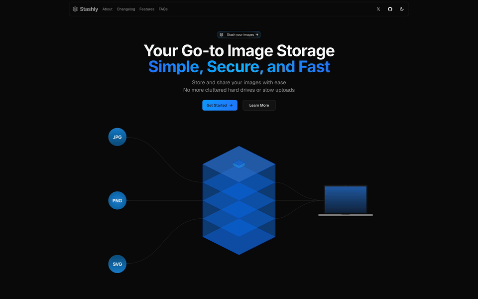

# Stashly

A personal image storage platform that's secure, fast, and easy to use.



## Features

- Upload images via drag-and-drop
- Organize with collections
- Star important images
- Trash with recovery option
- Dark/light themes
- Responsive design

## Tech Stack

- Next.js 15 + TypeScript
- Tailwind CSS v4 + Shadcn UI
- Drizzle ORM + PostgreSQL (NeonDB)
- Clerk for auth
- ImageKit for storage
- Vercel for hosting

## Getting Started

1. Clone the repo:
   ```bash
   git clone https://github.com/username/stashly.git
   cd stashly
   ```

2. Install dependencies:
   ```bash
   bun install
   ```

3. Set up environment:
   ```bash
   cp .env.example .env.local
   # Fill in your API keys
   ```

4. Start the dev server:
   ```bash
   bun dev
   ```

5. Open [http://localhost:3000](http://localhost:3000)

## Project Structure

```
stashly/
├── app/              # Next.js routes
├── components/       # React components
├── lib/              # Utilities
├── public/           # Static assets
├── db/               # Database schema
├── types/            # TypeScript types
└── middleware.ts     # Auth middleware
```

## Contributing

PRs welcome! Fork the repo, create a feature branch, and submit your changes.

## License

[MIT LICENCE](./LICENSE.md)

